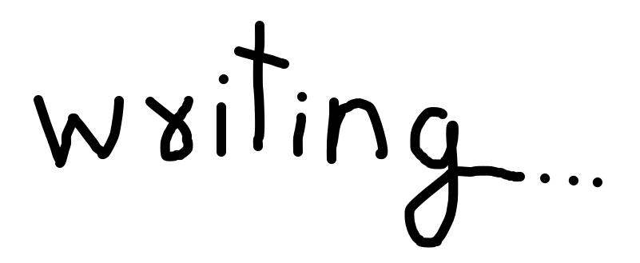

~~# A write-up about writing - 20th Dec, 2024~~
# An oddly personal write-up about writing - 20th Dec, 2024

Apparently, I like to write a lot more than I thought I liked to write. I realised this while writing out an elaborate reply to a comment thread on reddit under a post I posted from one of my throwaway accounts that must not be revealed and, with unignorable certainty, will destroy my career if revealed. 

I've tried this before, but I end up going blank whenever I sit down to write about something. I actually really appreciate quirky write-ups like on mitxela.com (I'm copying a lot of ideas from this guy, find him way too "maybe this is who I wanna be"-ish (Even this site was inspired from his, if this write-up ever gets there (now this is a bracket inside a bracket inside a bracket, I've digressed too far))). They're pretty amusing to me; they feel so free, like one's trying to speak their mind, not afraid of exploring funny ideas here and there. Anyways, I've decided to do something similar this time. Trying not to think too much and type out whatever I can think of without being afraid of how it'll be interpreted, and I can always hit the backspace if I type out something too controversial or personal. 

And about being able to go back and redo a sentence, it's becoming clear to me how powerful writing can be now that I'm actually doing it. You get to think more on a sentence if you need to, think less if you need to, get rid of it if you need to, or just hit Ctrl+A and Backspace if you need to, and nothing ever happened. Much easier than talking, when there a lot more layers in between what you're trying to express and what is received on the other side, not to mention the biological challenge of speaking (but maybe that's just me). You don't get to go back or speak at your own pace or even listen at you own pace, and you have to do all the thinking in between. But I suppose that has a different impact, and that efficiency of how much extra information you can transfer through tone, body language, intonation (that's right I took a phonetics course) and whatever else comes at a cost.

It also helps that I like to type. Mashing your fingers away on fun little tactile buttons is no different than those fidget toys people love to fidget with, and I like to fidget. I've also started to keep little pocket diaries (along with bigger ones) and learnt shorthand so nobody else could read what I write (unless they're willing to learn an entire new writing system to read my godforsaken notes, in which case, I might even recite them to you myself).

I also realise I use too many brackets and commas and don't understand when to use one or the other: I did a thing, it was cool. I did a thing (it was cool). See? (shout out to "I did a thing" channel on youtube, really amusing). I do sometimes read whatever's inside a bracket in a different tone like an inside voice and probably how I decide what to use. There's probably some grammatical explanation on what to use when but I'm not gonna bother with any grammitical shenanigans on this article, it has to be raw (unless they're too embarrassing).

Now I wonder whether this should be posted under my name, posted anonymously, or no be available for the public to read at all. I recently read that we should open up more, as that's a necessary foundation to build trust upon, and bla bla bla. Why does anyone ever post anything? (I've worked hard to integrate a comment section below if you have an appealing reply) I think I'll silently put it up on my site and see how it goes.
